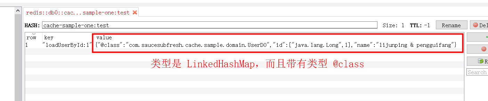
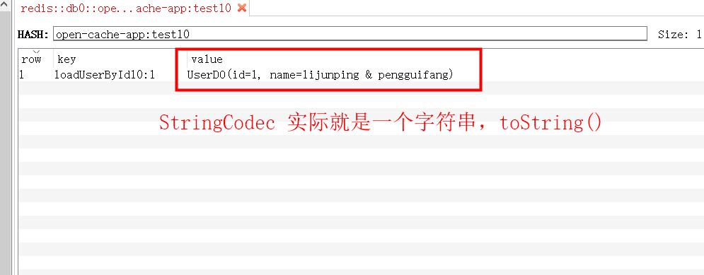
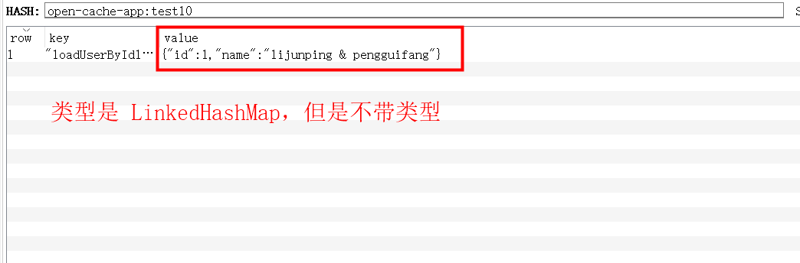
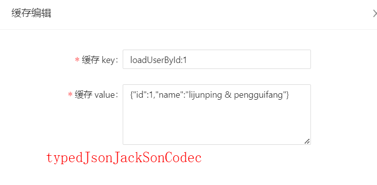

# 关于缓存序列化方式选择问题

## JsonJacksonCodec

JsonJacksonCodec 序列化方式的使用场景及优缺点分析如下：

1. 使用场景：我们知道 JsonJacksonCodec 序列化后的数据类型是 LinkedHashMap 且带类型，序列化结果如下：

那么如果你想要通过后台进行更新或插入缓存数据就会非常麻烦，因为不能简单的传入 json，还需要指定类型

2. 优点：不需要进行反序列化协助，即不需要写 CustomCacheProcessor 类

3. 缺点：缺点就是通过后台手动更新缓存中的值非常麻烦，需要处理类型

## StringCodec

1. 使用场景：我们知道 StringCodec 序列化后的数据类型是字符串，就是调用对象的 toString 后的字符串，序列化结果如下：

那么如果你想要通过后台进行更新或插入缓存数据就会非常麻烦，因为它不是一个 json

2. 优点：不需要进行反序列化协助，即不需要写 CustomCacheProcessor 类

3. 缺点：缺点就是通过后台手动更新缓存中的值非常麻烦，因为它不是一个 json

## TypedJsonJacksonCodec

1. 使用场景：我们知道 TypedJsonJacksonCodec 序列化后的数据类型是 LinkedHashMap 且不带类型，序列化结果如下：

那么如果你想要通过后台进行更新或插入缓存数据就会非常简单，因为可以是简单的 json

2. 优点：通过后台手动更新缓存中的值非常简单，主要是 json 变得简单了

3. 缺点：需要进行反序列化协助，不然会报类型转换异常，因为 LinkedHashMap 不带类型，系统不能不知道要转化成什么类型，所以需要写 CustomCacheProcessor 类，目的就是拿到方法返回类型进行反序列化

# 总结

就我们的需求来说，TypedJsonJacksonCodec 序列化方式非常符合我们的需求

